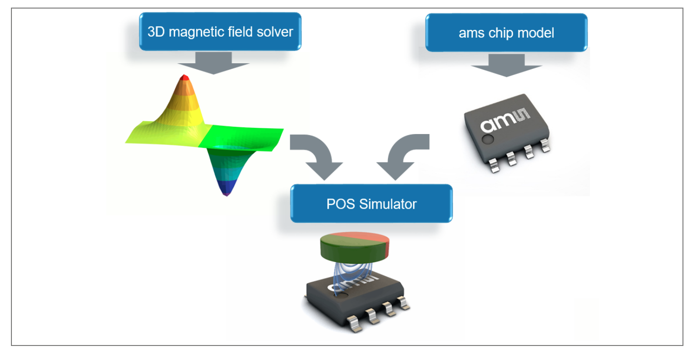

# POS-simulator
The POS Simulator tool accelerates and simplifies the system design and implementation process of ams OSRAM magnetic position sensors. The aim is to optimize the mechanical and magnetic design of the system to enable the best possible sensor performance.

## Getting started

1. Download and install LabVIEW Runtime engine Version 2016 32-bit. You can download it from [ni webpage](https://www.ni.com/) or directly from [here](https://github.com/ams-OSRAM/POS-simulator/releases/latest) as `LVRTE2016_f7Patchstd.zip`
2. Download `POS_Simulator_*.exe` - [here](https://github.com/ams-OSRAM/POS-simulator/releases/latest)
3. Ensure stabile internet connection. The magnetic field modeling happens on an ams OSRAM server which is located in Austria.
4. Run the `POS_Simulator_*.exe` file.
5. Ensure that the "Server V8 is available" statement is given. If not, it could happen that due to IT security configurations in your network the server connection is blocked. As workaround a public or private internet access point could solve the issue.
6. Refer to software manual `POS_Simulator_*.pdf` for further information - [here](https://github.com/ams-OSRAM/POS-simulator/releases/latest)

